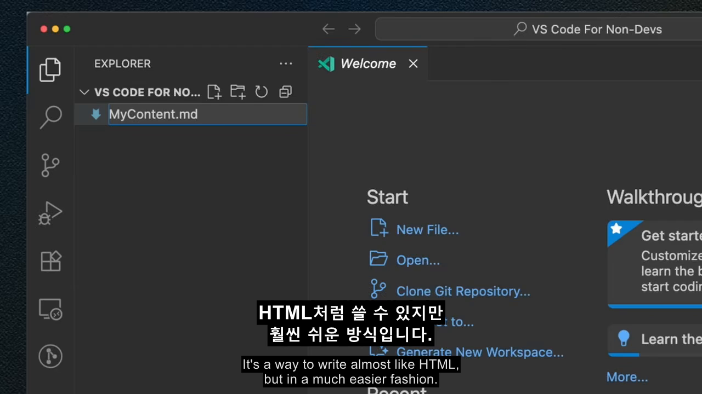

# 🎬 video-subtitle-toolkit

YouTube / X(Twitter) 영상을 다운로드하고, 한/영 이중자막을 생성해 영상에 번인(burn-in)하는 툴킷입니다.

Download videos from YouTube / X(Twitter), generate bilingual (Korean + English) subtitles, and burn them into the video.

---

## 📥 Installation

SKILL.md is based on the [Agent Skills Open Standard](https://github.com/anthropics/agent-skills-spec) and works natively across 14+ AI coding tools.

### Tier 1 — Native SKILL.md support (works as-is)

| Tool | Install Path |
|------|-------------|
| **VS Code Copilot** | `.github/skills/` (per-project) or `~/.claude/skills/` (global) |
| **Claude Code** | `~/.claude/skills/` (global) |
| **Codex CLI / Gemini CLI / Kiro / Antigravity** | `~/.agents/skills/` (universal) |
| **Goose** | `~/.config/goose/skills/` |
| **OpenCode** | `~/.config/opencode/skills/` |

### Tier 2 — Auto-adapted (installer converts format)

| Tool | Install Path | Format |
|------|-------------|--------|
| **Cursor** | `.cursor/rules/` | `.mdc` |
| **Windsurf** | `.windsurf/rules/` | `.md` rules |
| **Cline** | `.clinerules/` | plain markdown |
| **Roo Code** | `.roo/rules/` | plain markdown |
| **Trae** | `.trae/rules/` | plain markdown |

---

### Quick Install

```bash
# VS Code Copilot (per-project)
npx degit binnu-dev/video-subtitle-toolkit .github/skills/video-subtitle-toolkit

# Claude Code + VS Code Copilot (global — works in all projects)
git clone https://github.com/binnu-dev/video-subtitle-toolkit.git ~/.claude/skills/video-subtitle-toolkit

# Codex CLI / Gemini CLI / Kiro / Antigravity (universal path)
git clone https://github.com/binnu-dev/video-subtitle-toolkit.git ~/.agents/skills/video-subtitle-toolkit

# Cursor (per-project)
git clone https://github.com/binnu-dev/video-subtitle-toolkit.git .cursor/rules/video-subtitle-toolkit

# Windsurf (per-project)
git clone https://github.com/binnu-dev/video-subtitle-toolkit.git .windsurf/rules/video-subtitle-toolkit

# Kiro (per-project)
git clone https://github.com/binnu-dev/video-subtitle-toolkit.git .kiro/skills/video-subtitle-toolkit
```

> **Cursor / Windsurf 사용자**: SKILL.md frontmatter는 그냥 무시되고 본문만 rules로 읽혀요. 따로 변환 불필요.

### Update

```bash
cd ~/.claude/skills/video-subtitle-toolkit && git pull
# 또는
cd ~/.agents/skills/video-subtitle-toolkit && git pull
```

---

## 🖼️ Preview



*한국어(상단 굵게) + 영어(하단 얇게) 이중자막 스타일 — v6 최종 승인 스타일*

---

## ✨ Features

- **YouTube 다운로드** — yt-dlp로 최대 1080p 다운로드
- **X(Twitter) 다운로드** — CDP(Chrome DevTools Protocol) 네트워크 캡처 방식
- **자막 추출** — YouTube 자동 자막(VTT) → 문장 단위 JSON
- **Whisper 전사** — 자막 없는 영상(X 등)을 OpenAI Whisper로 음성 전사
- **이중자막 ASS 생성** — 한국어(상단) + 영어(하단) 스타일로 ASS 변환
- **ffmpeg 번인** — 자막을 영상에 하드코딩

---

## 📦 Prerequisites (Dependencies)

| Tool | Install |
|------|---------|
| **Python 3.9+** | [python.org](https://www.python.org/) |
| **ffmpeg** (libass 포함) | `winget install Gyan.FFmpeg` |
| **Node.js** | [nodejs.org](https://nodejs.org/) — X 영상 캡처 시 필요 |
| **Noto Sans KR** | [Google Fonts](https://fonts.google.com/noto/specimen/Noto+Sans+KR) — 자막 폰트 |

### Python 패키지 설치

```bash
# 가상환경 권장
python -m venv .venv
source .venv/bin/activate   # Windows: .venv\Scripts\activate

pip install -r requirements.txt
```

### Node.js 패키지 설치 (X 영상 캡처 시만)

```bash
npm install
```

---

## 🚀 Quick Start

### YouTube 이중자막 워크플로우

```bash
# 1. 영상 다운로드
yt-dlp -f "bestvideo[height<=1080]+bestaudio" -o "output.mp4" "YOUTUBE_URL"

# 2. 영어 자막(VTT) 다운로드
yt-dlp --write-auto-sub --sub-lang en --skip-download \
  --extractor-args "youtube:player_client=ios,web" \
  -o "subs" "YOUTUBE_URL"

# 3. VTT → 문장 단위 JSON
python scripts/extract_by_sentence.py --vtt subs.en.vtt --output sentence_cues.json

# 4. 한국어 번역 + 이중자막 SRT 작성 (수동 또는 LLM 활용)
# 형식: 각 블록에 영어 + 한국어 2줄

# 5. SRT → ASS 변환
python scripts/gen_ass.py --srt input.srt --ass output.ass

# 6. ffmpeg 번인
ffmpeg -y -i output.mp4 -vf "ass=output.ass" -c:a copy final.mp4
```

> **Windows 경로 주의**: 경로에 공백이 있으면 ffmpeg `ass=` 필터가 실패합니다.  
> 임시 폴더(`%TEMP%\subs_burn`)로 복사 후 실행하거나, 짧은 경로 사용을 권장합니다.

### X(Twitter) + Whisper 워크플로우

자세한 내용은 [SKILL.md](SKILL.md) 참조

---

## 📂 File Structure

```
video-subtitle-toolkit/
├── README.md
├── SKILL.md                      ← VS Code Copilot 스킬 정의 (전체 워크플로우)
├── requirements.txt
├── package.json
└── scripts/
    ├── extract_by_sentence.py   ← YouTube VTT → 문장 단위 JSON
    ├── gen_ass.py               ← SRT → ASS 이중자막 변환
    └── capture_video_url.js    ← X(Twitter) CDP 비디오 URL 캡처
```

---

## 🎨 Subtitle Style (v6)

반복 테스트를 거쳐 확정된 이중자막 스타일:

| 속성 | 한국어 (상단) | 영어 (하단) |
|------|-------------|------------|
| 폰트 | Noto Sans KR Medium | Noto Sans KR DemiLight |
| 크기 | 39pt | 27pt |
| Bold | Yes | No |
| 글자색 | 흰색 | 반투명 흰색 |
| 배경 | 검정 박스 | 검정 박스 |
| 기준 해상도 | 1280×720 | — |

---

## 📋 SRT Format (Bilingual)

```
1
00:00:00,200 --> 00:00:03,500
This is the English subtitle line.
이것은 한국어 자막 줄입니다.
```

---

## 🔧 Troubleshooting

| 문제 | 원인 | 해결 |
|------|------|------|
| yt-dlp 403 에러 | 구버전 yt-dlp | `pip install -U yt-dlp` |
| VTT 다운로드 실패 | 클라이언트 제한 | `--extractor-args "youtube:player_client=ios,web"` 추가 |
| ffmpeg `ass=` 필터 에러 | 경로에 공백/특수문자 | `%TEMP%\subs_burn`으로 복사 후 실행 |
| 자막 싱크 어긋남 | VTT 롤링 윈도우 중복 | `extract_by_sentence.py`의 "마지막 줄만" 파싱으로 해결됨 |
| 폰트 없음 | Noto Sans KR 미설치 | [Google Fonts](https://fonts.google.com/noto/specimen/Noto+Sans+KR) 설치 |
| CDP 연결 실패 | 디버그 모드 미실행 | Edge/Chrome `--remote-debugging-port=9222` 옵션으로 실행 |

---

## 📄 License

MIT
